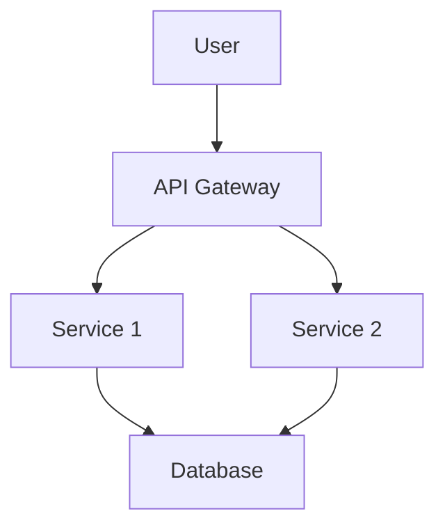
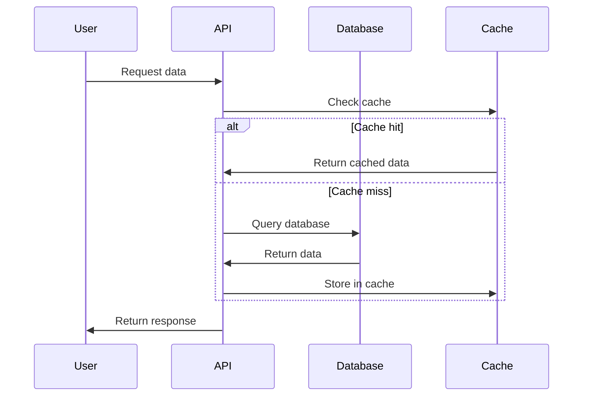

# Documentation Generator Command

プロジェクトのドキュメントを自動生成・更新するコマンドです。API仕様、README、コードドキュメント等を統合管理します。

## 実行内容

1. コードベースの解析とAPIドキュメント生成
2. README/設定ファイルの自動生成・更新
3. アーキテクチャ図・フロー図の作成
4. チームドキュメントの生成・同期
5. 多言語対応ドキュメントの管理

## 使用方法

```
/doc-generator [type] [--format=markdown|html|pdf] [--language=ja|en]
```

## ドキュメントタイプ

### 1. API ドキュメント (api)
```
/doc-generator api [--spec=openapi|graphql] [--interactive]
```
- OpenAPI/Swagger仕様書生成
- GraphQL スキーマドキュメント
- エンドポイント一覧と使用例
- 認証・レスポンス形式の説明

### 2. README生成 (readme)
```
/doc-generator readme [--template=standard|detailed|minimal]
```
- プロジェクト概要と目的
- インストール・セットアップ手順
- 使用方法と基本例
- 貢献ガイドライン

### 3. コードドキュメント (code)
```
/doc-generator code [--include-private] [--coverage]
```
- 関数・クラス・モジュールの説明
- コードコメントからの自動抽出
- 型定義・インターフェース仕様
- 使用例とサンプルコード

### 4. アーキテクチャドキュメント (architecture)
```
/doc-generator architecture [--diagrams] [--detailed]
```
- システム構成図
- データフロー図
- ER図・クラス図
- デプロイメント構成

### 5. ユーザーガイド (guide)
```
/doc-generator guide [--interactive] [--screenshots]
```
- 操作手順書
- トラブルシューティング
- FAQ・よくある質問
- ベストプラクティス

## プロジェクトタイプ別生成

### Node.js/TypeScript プロジェクト
```json
{
  "scripts": {
    "docs:api": "typedoc --out docs/api src/",
    "docs:readme": "readme-md-generator",
    "docs:build": "npm run docs:api && npm run docs:readme"
  },
  "documentation": {
    "api": {
      "tool": "typedoc",
      "include": ["src/**/*.ts"],
      "exclude": ["**/*.test.ts", "**/*.spec.ts"]
    },
    "readme": {
      "template": "detailed",
      "sections": ["installation", "usage", "api", "contributing"]
    }
  }
}
```

### Python プロジェクト
```toml
[tool.sphinx]
source-dir = "docs/source"
build-dir = "docs/build"
extensions = [
    "sphinx.ext.autodoc",
    "sphinx.ext.viewcode",
    "sphinx.ext.napoleon"
]

[tool.documentation]
api = { tool = "sphinx", format = "html" }
readme = { template = "standard", include_badges = true }
```

### Go プロジェクト
```go
//go:generate godoc -http=:6060
//go:generate go doc -all > docs/api.txt

// Documentation configuration
type DocConfig struct {
    APITool     string   `yaml:"api_tool"`     // godoc, swaggo
    OutputDir   string   `yaml:"output_dir"`   // docs/
    Formats     []string `yaml:"formats"`      // html, markdown
    IncludeExamples bool `yaml:"include_examples"`
}
```

### Rust プロジェクト
```toml
[package.metadata.docs.rs]
features = ["full"]
rustdoc-args = ["--cfg", "docsrs"]

[package.metadata.documentation]
api = { tool = "rustdoc", format = "html" }
readme = { template = "rust-standard" }
```

## 自動生成フロー

### 1. コードベース解析
```bash
# 依存関係解析
- package.json/Cargo.toml/go.mod 解析
- インポート・エクスポート関係の抽出
- 外部ライブラリ・フレームワークの特定

# コード構造解析
- ディレクトリ構造の可視化
- 主要なクラス・関数の抽出
- API エンドポイントの検出
```

### 2. メタデータ収集
```bash
# Git情報
- 貢献者リスト
- リリース履歴
- 変更ログ

# プロジェクト設定
- ライセンス情報
- CI/CD設定
- デプロイメント環境
```

### 3. ドキュメント生成
```bash
# テンプレート適用
- プロジェクトタイプに応じたテンプレート選択
- カスタマイズ設定の適用
- 多言語対応処理

# コンテンツ生成
- 自動コメント生成
- サンプルコード作成
- 図表・チャート生成
```

## API ドキュメント生成例

### OpenAPI/Swagger
```yaml
# 自動生成されるOpenAPI仕様
openapi: 3.0.0
info:
  title: Project API
  version: 1.0.0
  description: Automatically generated API documentation
  
paths:
  /api/users:
    get:
      summary: Get users list
      description: Retrieve a list of all users
      responses:
        '200':
          description: Successful response
          content:
            application/json:
              schema:
                type: array
                items:
                  $ref: '#/components/schemas/User'
                  
components:
  schemas:
    User:
      type: object
      required:
        - id
        - name
      properties:
        id:
          type: integer
          description: User ID
        name:
          type: string
          description: User name
```

### GraphQL スキーマ
```graphql
# 自動生成されるGraphQLドキュメント
"""
User management API
"""
type Query {
  """
  Get user by ID
  """
  user(id: ID!): User
  
  """
  Get all users
  """
  users: [User!]!
}

type User {
  """
  Unique user identifier
  """
  id: ID!
  
  """
  User display name
  """
  name: String!
  
  """
  User email address
  """
  email: String!
}
```

## README テンプレート

### 標準テンプレート
```markdown
# Project Name

Brief description of what this project does.

## Installation

```bash
npm install project-name
```

## Usage

```javascript
const project = require('project-name');
console.log(project.hello('world'));
```

## API Reference

### Methods

#### `hello(name)`
- **Parameters**: `name` (string) - Name to greet
- **Returns**: string - Greeting message
- **Example**: `hello('world')` returns `"Hello, world!"`

## Contributing

1. Fork the repository
2. Create a feature branch
3. Make your changes
4. Add tests
5. Submit a pull request

## License

MIT License - see LICENSE file for details.
```

### 詳細テンプレート
```markdown
# Project Name

[](https://github.com/user/repo/actions)
[](https://codecov.io/gh/user/repo)
[](https://www.npmjs.com/package/project-name)

## Table of Contents

- [Features](#features)
- [Installation](#installation)
- [Quick Start](#quick-start)
- [API Documentation](#api-documentation)
- [Examples](#examples)
- [Contributing](#contributing)
- [Changelog](#changelog)

## Features

- ✅ Feature 1
- ✅ Feature 2
- 🚧 Feature 3 (In development)

## Architecture



## Performance

| Operation | Time | Memory |
|-----------|------|--------|
| Create    | 1ms  | 10MB   |
| Read      | 0.5ms| 5MB    |
| Update    | 2ms  | 15MB   |
| Delete    | 1ms  | 5MB    |
```

## アーキテクチャ図生成

### システム構成図
```mermaid
# 自動生成されるMermaid図
graph TB
    subgraph "Frontend"
        A[React App]
        B[Vue App]
    end
    
    subgraph "Backend"
        C[API Server]
        D[Auth Service]
        E[File Service]
    end
    
    subgraph "Database"
        F[PostgreSQL]
        G[Redis]
        H[S3]
    end
    
    A --> C
    B --> C
    C --> D
    C --> E
    C --> F
    D --> G
    E --> H
```

### データフロー図


## 多言語対応

### 日本語ドキュメント
```markdown
# プロジェクト名

このプロジェクトの簡単な説明。

## インストール方法

```bash
npm install project-name
```

## 使用方法

```javascript
const project = require('project-name');
console.log(project.hello('world'));
```
```

### 英語ドキュメント
```markdown
# Project Name

Brief description of this project.

## Installation

```bash
npm install project-name
```

## Usage

```javascript
const project = require('project-name');
console.log(project.hello('world'));
```
```

## 継続的ドキュメント更新

### Git Hooks統合
```bash
# Pre-commit hook
#!/bin/sh
echo "Updating documentation..."
/doc-generator readme --auto-update
/doc-generator api --incremental
git add docs/ README.md
```

### CI/CD統合
```yaml
name: Documentation Update
on:
  push:
    branches: [main]
    paths: ['src/**', 'api/**']

jobs:
  update-docs:
    runs-on: ubuntu-latest
    steps:
      - uses: actions/checkout@v3
      - name: Generate Documentation
        run: |
          /doc-generator api --format=html
          /doc-generator readme --template=detailed
          /doc-generator architecture --diagrams
      - name: Deploy to GitHub Pages
        uses: peaceiris/actions-gh-pages@v3
        with:
          github_token: ${{ secrets.GITHUB_TOKEN }}
          publish_dir: ./docs
```

このコマンドは、プロジェクトドキュメントの作成・維持を自動化し、常に最新で正確な情報を提供します。